# Apache [Kafka]()
## for Fast Data Pipelines

**Markus Günther**

Freelance Software Engineer / Architect

[markus.guenther@gmail.com](mailto:markus.guenther@gmail.com) | [habitat47.de](http://www.habitat47.de) | [@mguenther](https://twitter.com/mguenther)

---

### How [data pipelines]() start off

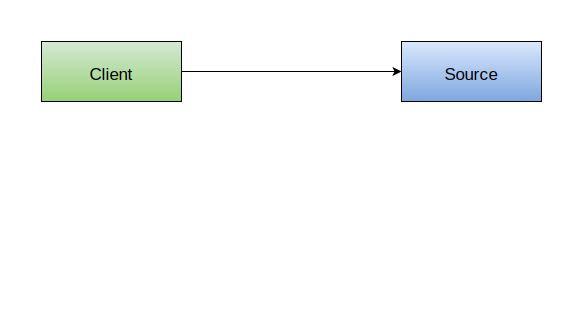

----

### How [data pipelines]() start off (cont'd)

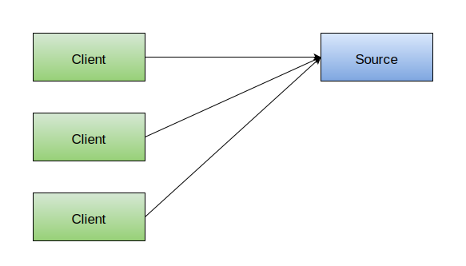

----

### How [data pipelines]() start off (cont'd)

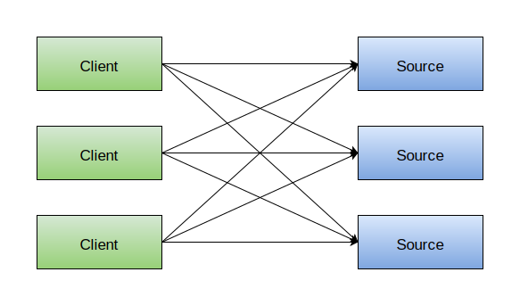

----

### How [data pipelines]() start off (cont'd)

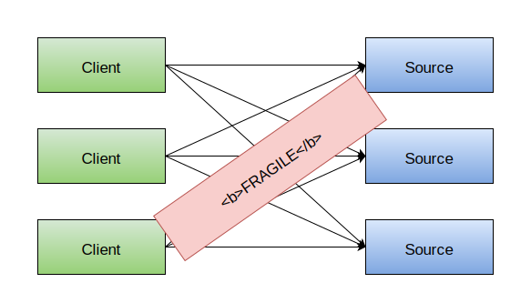

----

### Decoupling [data pipelines]()

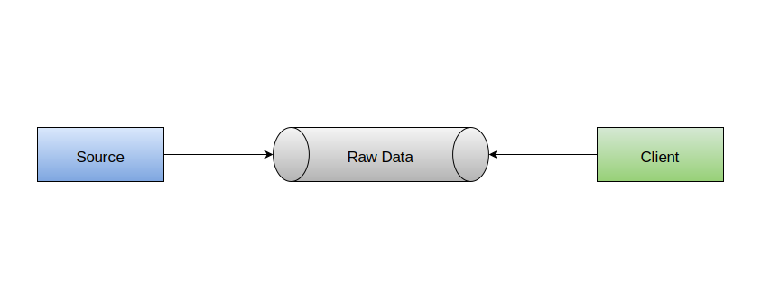

----

### Decoupling [data pipelines]() (cont'd)

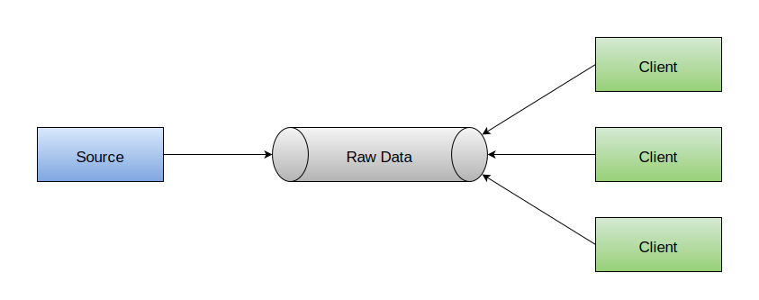

----

### Decoupling [data pipelines]() (cont'd)

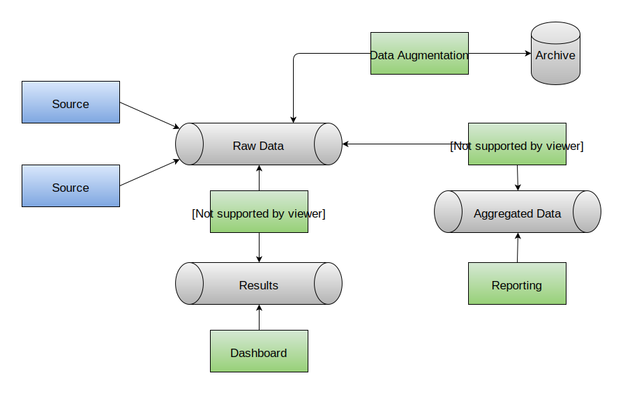

----

### What drives the [design]() of a [data pipeline]()?

* High throughput<!-- .element: class="fragment" data-fragment-index="1" -->
* Horizontal scalability<!-- .element: class="fragment" data-fragment-index="2" -->
* High availability<!-- .element: class="fragment" data-fragment-index="3" -->
* No data loss<!-- .element: class="fragment" data-fragment-index="4" -->
* Satisfies (soft) real-time constraints<!-- .element: class="fragment" data-fragment-index="5" -->
* Enforces structure of data<!-- .element: class="fragment" data-fragment-index="6" -->
* Single source of truth<!-- .element: class="fragment" data-fragment-index="7" -->

---

## Enter Apache [Kafka]()

----

### [Overview]()

* Apache project, originated at LinkedIn<!-- .element: class="fragment" data-fragment-index="1" -->
* Distributed publish-subscribe messaging system<!-- .element: class="fragment" data-fragment-index="2" -->
* Supports both queue and topic semantics<!-- .element: class="fragment" data-fragment-index="3" -->

----

### [Point-to-Point]() Messaging

##### (Queue Semantics)

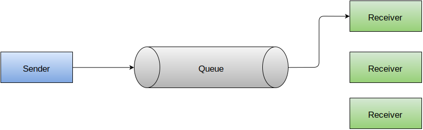

----

### [Publish-Subscribe]() Messaging

##### (Topic Semantics)

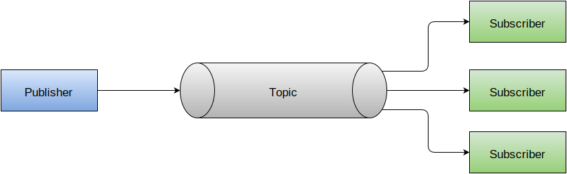

----

### [Overview]()

* Apache project, originated at LinkedIn
* Distributed publish-subscribe messaging system
* Supports both queue and topic semantics
* Designed for real-time processing of events<!-- .element: class="fragment" data-fragment-index="1" -->
* Has at-least-once messaging semantics<!-- .element: class="fragment" data-fragment-index="2" -->
* No integration with JMS<!-- .element: class="fragment" data-fragment-index="3" -->
* Written in Scala<!-- .element: class="fragment" data-fragment-index="4" -->

----

### [Key Innovations]()

* Messages are acknowledged in order<!-- .element: class="fragment" data-fragment-index="1" -->
* Messages are persisted for days / weeks<!-- .element: class="fragment" data-fragment-index="2" -->
* Consumers can manage their offsets<!-- .element: class="fragment" data-fragment-index="3" -->

----

### General Arrangement of a [Kafka]() Cluster

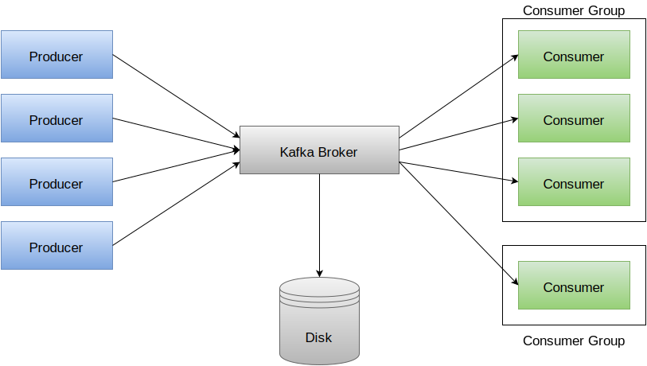

----

### What is the role of [ZooKeeper]()?

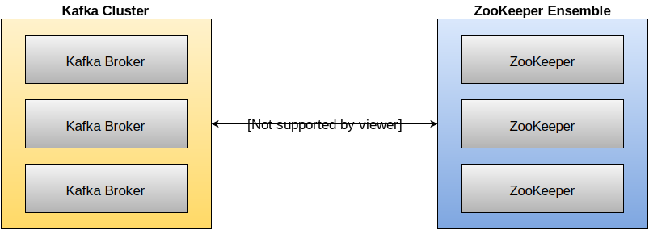

----

### Relationships between [Producers](), [Consumers](), [Topics]()

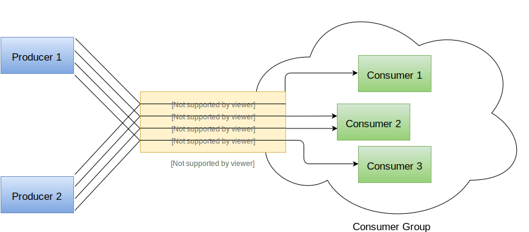

----

### [Topics]() and [Partitions]() are replicated

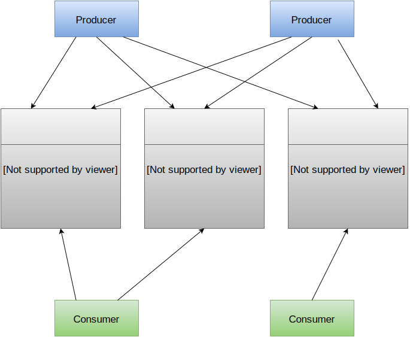

----

### [Append-Only]() Logs Consumed [Sequentially]()

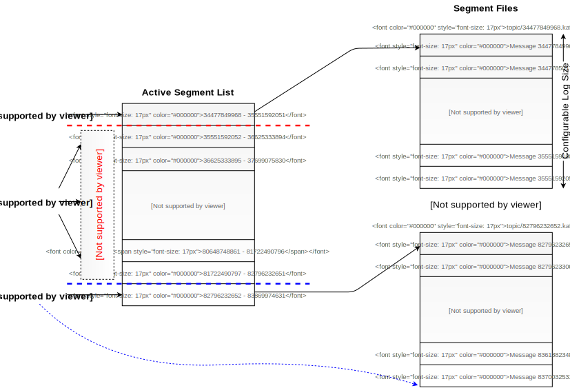

----

### So, how fast is this thing?

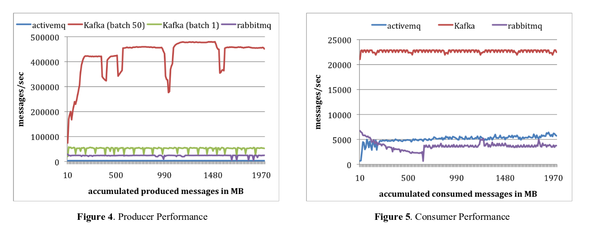

----

### The [KafkaProducer]() API

```scala
object SimpleProducer extends App {

  val props = new Properties
  props.put("bootstrap.servers", "127.0.0.1:9092")
  props.put("key.serializer",
    "org.apache.kafka.common.serialization.StringSerializer")
  props.put("value.serializer",
    "org.apache.kafka.common.serialization.StringSerializer")

  val producer = new KafkaProducer[String, String](props)

  (1 to 100).foreach(i => {
    val message = new ProducerRecord[String, String](
      "test", 
      i.toString, // key
      i.toString) // payload
    producer.send(message)
  })

  producer.close()
}

```

----

### The [KafkaConsumer]() API

```scala
object SimpleConsumer extends App {

  val props = new Properties
  props.put("bootstrap.servers", "localhost:9092")
  props.put("group.id", "scala-rhein-main-group")
  props.put("enable.auto.commit", "true")
  props.put("key.deserializer", 
    "org.apache.kafka.common.serialization.StringDeserializer")
  props.put("value.deserializer", 
    "org.apache.kafka.common.serialization.StringDeserializer")

  val consumer = new KafkaConsumer[String, String](props)
  consumer.subscribe(seqAsJavaList(List("test")))

  while (true) {
    val records = consumer.poll(100)
    JavaConversions
      .asScalaIterator(records.iterator)
      .foreach(record => 
        logger.info(s"offset=${record.offset}, key=${record.key}, value=${record.value}"))
  }
```

---

# Demo

---

## [Kafka]() Gotchas and Best Practices

---

## No Inherent Serialization Mechanism

----

### [#1:]() Use a consistent [serialization mechanism]()

----

### The four stages of serializing data

1. Use the built-in serialization of your language
2. Use language-agnostic formats
3. Invent your own serialization on top of a language-agnostic one
4. Schema and documentation for the win!

----

#### Which [serialization framework]() should I use?


----

#### [Apache Avro]() is suitable for streaming applications

* Schema representation in JSON or an IDL
* Supports the usual types
  * Primitive Types: boolean, int, long, string, etc.
  * Complex Types: Record, Enum, Array, Union, Map, Fixed
* Data is (de-)serialized using its schema
* Compact binary output

----

### How does a schema look like in [Apache Avro]()?

```json
{
  "namespace": "com.mgu.kafkaexamples.avro",
  "type": "record",
  "name": "Message",
  "fields": [
    {"name": "messageId", "type": "string"},
    {"name": "text", "type": "string"}
  ]
}
```

----

### ... or using an [IDL]()

```
@namespace("com.mgu.kafkaexamples.avro")
protocol SimpleExample {
  record Message {
    string messageId;
    string name;
  }
}
```

----

A JSON-based representation of ```Message```

```json
{
  "messageId": "f9ae42fc",
  "text": "Hello!"
}
```

is compiled to this using Apache Avro


----

### How can I include [Avro]() in my Scala project?

```scala
libraryDependencies ++= Seq(
  ...
  "org.apache.avro" % "avro" % "1.6.3",
  "com.twitter" %% "bijection-avro" % "0.9.2")

Seq(sbtavro.SbtAvro.avroSettings : _*)

javaSource in sbtavro.SbtAvro.avroConfig <<= (sourceDirectory in Compile)(_ / "generated")

(stringType in avroConfig) := "String"
```

----

### Use [```bijection-avro```]() for bijective mappings

```scala
def serialize(payload: T): Option[Array[Byte]] = 
  try {
    Some(SpecificAvroCodecs.toBinary[T].apply(payload))
  } catch {
    case ex: Exception => None
  }
```

... and vice versa ...


```scala
def deserialize(payload: Array[Byte]): Option[T] =
  try {
    Some(SpecificAvroCodecs.toBinary[T].invert(payload).get)
  } catch {
    case ex: Exception => None
  }
```

---

## Kafka employs [at-least-once]() semantics wrt. messaging

----

### [#2:]() Use idempotent message handlers if possible

----

### [#3:]() Use a de-duplication filter if messages are non-idempotent

---

## Potential of [Huge]() Data Loss at [Broker](), [Producer]() and [Consumer]()

----

> "For a topic with replication factor N, Kafka can tolerate up to N-1 server failures without losing any messages committed to the log."

----

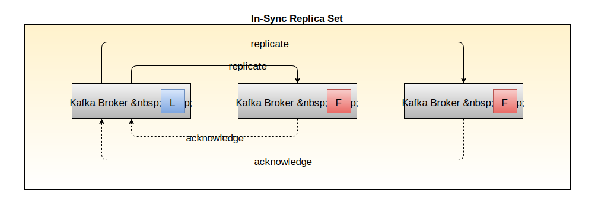

----

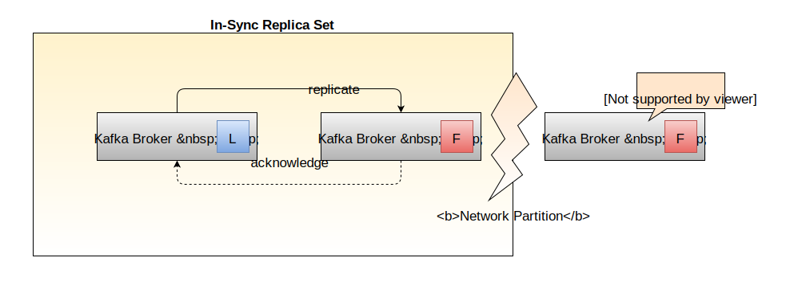

----

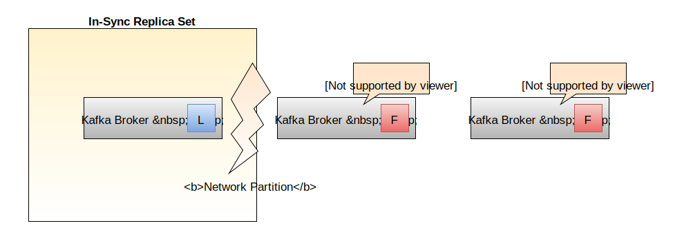

----

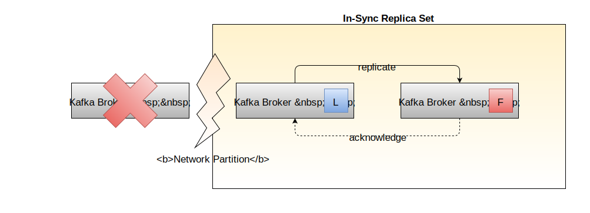

----

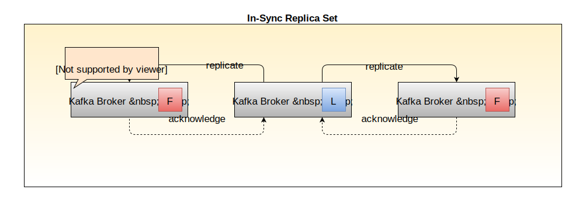

----

### [#4:]() Disable unclean leader election
	

----


### [#5:]() Monitor the size of in-sync-replica sets

----

### [#6:]() Commit consumer offsets manually

---

## Mirroring considered dangerous

----


### [#7:]() Do not use mirroring for disaster recovery

----

### [Mirroring]() does not preserve offsets

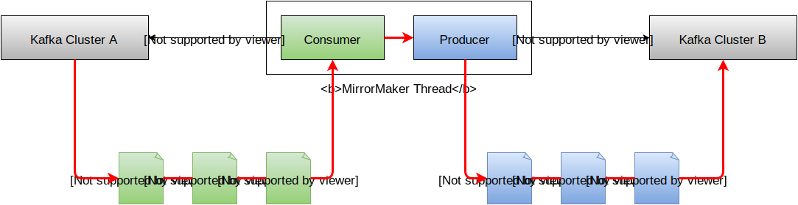

----

### [#8:]() Do not use mirroring for a chain-of-replication

---

## Going into production

----

### [#9:]() Limit the number of topics and partitions

----

### [#10:]() Disable automatic topic creation

----

### [#11:]() Use a consistent hashing scheme for keyed messages

---

### [Advanced]() Topics and [Outlook]()

* Lossless data pipelines<!-- .element: class="fragment" data-fragment-index="1" -->
* Messaging backbone for<!-- .element: class="fragment" data-fragment-index="2" -->
  * ... Microservices?<!-- .element: class="fragment" data-fragment-index="2" -->
  * ... Event-sourced systems?<!-- .element: class="fragment" data-fragment-index="2" -->
* Ecosystem grows<!-- .element: class="fragment" data-fragment-index="3" -->
  * Kafka Connect<!-- .element: class="fragment" data-fragment-index="3" -->
  * Kafka Streams<!-- .element: class="fragment" data-fragment-index="3" -->
  * Integrations with Hadoop, Storm, Samza, Flume, ...<!-- .element: class="fragment" data-fragment-index="3" -->

----

### [Takeaway]()

* Battle-proven technology for fast data pipelines<!-- .element: class="fragment" data-fragment-index="1" -->
* Easy-to-use API<!-- .element: class="fragment" data-fragment-index="2" -->
* Characteristics of a distributed commit log<!-- .element: class="fragment" data-fragment-index="3" -->
  * ... not a traditional message broker<!-- .element: class="fragment" data-fragment-index="3" -->
* No guarantee of message delivery<!-- .element: class="fragment" data-fragment-index="4" -->
* No reliable solution for multi-master replication<!-- .element: class="fragment" data-fragment-index="5" -->
* Monitoring? Enterprise?<!-- .element: class="fragment" data-fragment-index="6" --> [Confluent](http://www.confluent.io/)!<!-- .element: class="fragment" data-fragment-index="6" -->

---

# [Thank]() you!

## Any [Questions?]()

---

### [Sources]()

#### Blogs & Articles

* [Kafka: A Distributed Messaging System [...]](http://research.microsoft.com/en-us/um/people/srikanth/netdb11/netdb11papers/netdb11-final12.pdf) (Kreps et al.)
* [Jepsen: Kafka](https://aphyr.com/posts/293-jepsen-kafka) (Kingsbury)
* [Schema Evolution in Avro, Protocol Buffers [...]](https://martin.kleppmann.com/2012/12/05/schema-evolution-in-avro-protocol-buffers-thrift.html) (Kleppmann)

#### Talks

* [Introduction to Kafka and Zookeeper](http://www.slideshare.net/rahuldausa/introduction-to-kafka-and-zookeeper) (Jain)
* [Introduction to Apache Kafka](http://www.slideshare.net/jhols1/kafka-atlmeetuppublicv2) (Holoman)
* [No Data Loss Pipeline with Apache Kafka](http://www.slideshare.net/JiangjieQin/no-data-loss-pipeline-with-apache-kafka-49753844) (Qin)
* [From a Kafkaesque Story to the Promised Land](http://www.slideshare.net/ransilberman/from-a-kafkaesque-story-to-the-promised-land-23992927) (Silberman)

#### Books

* [Streaming Architecture](https://www.mapr.com/streaming-architecture-using-apache-kafka-mapr-streams) (Dunning et al.)