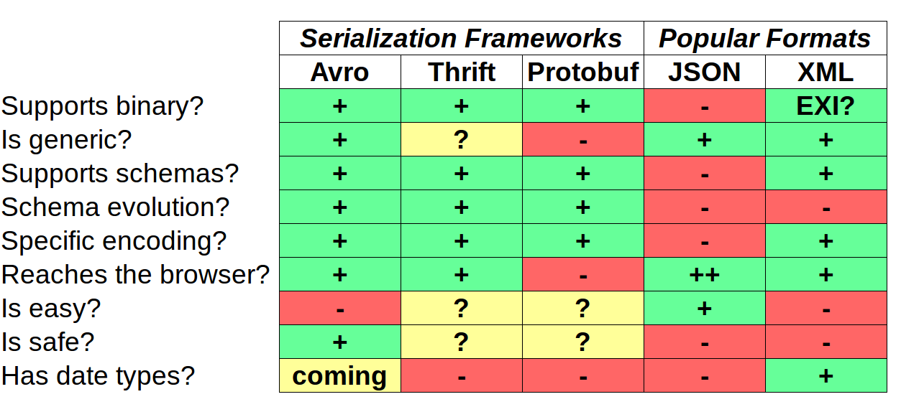
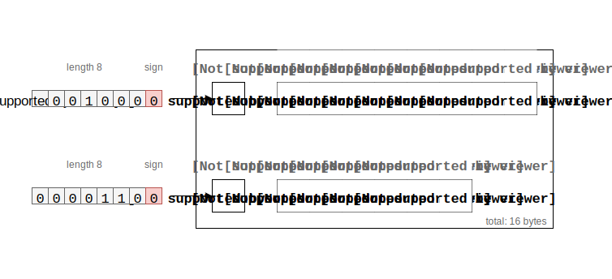

# Apache Kafka
## for Fast Data Pipelines

**Markus Günther**

Freelance Software Engineer / Architect

[markus.guenther@gmail.com](mailto:markus.guenther@gmail.com) | [habitat47.de](http://www.habitat47.de) | [@mguenther](https://twitter.com/mguenther)

---

## Best Practices

----

### Use a consistent serialization mechanism

----

### The four stages of serializing data

1. Use the built-in serialization of your language
2. Use language-agnostic formats
3. Invent your own serialization on top of a language-agnostic one
4. Schema and documentation for the win!

----

#### Which serialization framework should I use?

* Apache Thrift
* Apache Avro
* Google Protocol Buffers

----

#### Which serialization framework should I use?



----

#### Apache Avro is suitable for streaming applications

* Schema representation in JSON or an IDL
* Supports the usual types
  * Primitive Types: boolean, int, long, string, etc.
  * Complex Types: Record, Enum, Array, Union, Map, Fixed
* Data is (de-)serialized using its schema

----

### How does a schema look like in Apache Avro?

```json
{
  "namespace": "com.mgu.kafkaexamples.avro",
  "type": "record",
  "name": "Message",
  "fields": [
    {"name": "messageId", "type": "string"},
    {"name": "text", "type": "string"}
  ]
}
```

----

### ... or using an IDL

```
@namespace("com.mgu.kafkaexamples.avro")
protocol SimpleExample {
  record Message {
    string messageId;
    string name;
  }
}
```

----

```json
{
  "messageId": "f9ae42fc",
  "text": "Hello!"
}
```

is translated into this



----

### How can I include Avro in my Scala project?

```scala
libraryDependencies ++= Seq(
  ...
  "org.apache.avro" % "avro" % "1.6.3",
  "com.twitter" %% "bijection-avro" % "0.9.2")

Seq(sbtavro.SbtAvro.avroSettings : _*)

javaSource in sbtavro.SbtAvro.avroConfig <<= (sourceDirectory in Compile)(_ / "generated")

(stringType in avroConfig) := "String"
```

----

### Use ```bijection-avro``` for bijective mappings

```scala
def serialize(payload: T): Option[Array[Byte]] = 
  try {
    Some(SpecificAvroCodecs.toBinary[T].apply(payload))
  } catch {
    case ex: Exception => None
  }
```

... and vice versa ...


```scala
def deserialize(payload: Array[Byte]): Option[T] =
  try {
    Some(SpecificAvroCodecs.toBinary[T].invert(payload).get)
  } catch {
    case ex: Exception => None
  }
```

---

### Takeaway

* Property tests live longer than unit tests
* Tendency to find different bugs
* Less code, so more maintainable
  * Requires helper functions 
  * Generators / Shrinkers can be complex
* Do not rely on PBT solely! Use it alongside other approaches
* Use random generators for Strings with care!

---

# Thank you!

## Any Questions?

---

### Sources

#### Conference Talks

* [Property-Based Testing for Better Code](https://www.youtube.com/watch?v=shngiiBfD80) (Jessica Kerr @ Midwest.io 2014)  
* [Property-Based Testing: Shrinking Risk In Your Code](https://www.youtube.com/watch?v=hNhHmbiw4Rw) (Amanda Launcher @ YOW! 2015)
* [I Dream of Gen'ning: ScalaCheck Beyond the Basics](https://www.youtube.com/watch?v=lgyGFG6hBa0) (Kelsey Gilmore-Innis @ SBTB 2014)
* [How I learned to stop unit testing and love Property-Based Testing](http://blog.charleso.org/property-testing-preso/yowlj2015.html) (Charles O'Farrell)

#### Blogs

* [Choosing Properties for Property-Based Testing](https://fsharpforfunandprofit.com/posts/property-based-testing-2/) (Scott Wlaschin)