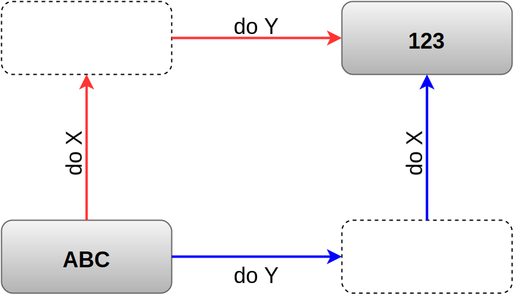
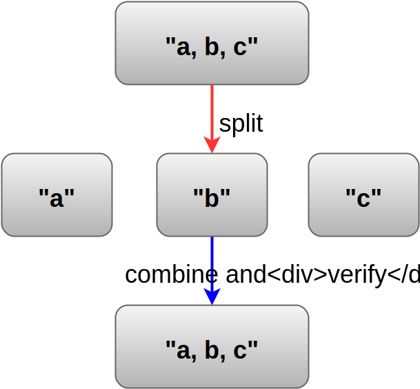

## Property-Based Testing

Markus Günther

[markus.guenther@gmail.com](mailto:markus.guenther@gmail.com) | [habitat47.de](http://www.habitat47.de) | [@mguenther](https://twitter.com/mguenther)

---

### Part I: A Motivating Example

----

### For some reason we are tasked with the implementation of a custom `add` function

----

### Of course, we want to test our implementation

----

```scala
class AddUnitTest extends FlatSpec with Matchers {

  "Adder" should "yield 4 when I add 1 + 3" in {
    add1(1, 3) shouldBe 4
  }

  "Adder" should "yield 4 when I add 2 + 2" in {
    add1(2, 2) shouldBe 4
  }
}
```

----

### Some time later, ops comes back with errors in production wrt. `add`

----

```scala
class AddUnitTest extends FlatSpec with Matchers {

  [...]

  "Adder" should "yield 2 when I add -1 + 3" in {
    add1(-1, 3) shouldBe 2
  }
}
```

----

### Boom!

```
[info] Adder
[info] - should yield 2 when I add -1 + 3 *** FAILED ***
[info]   4 was not equal to 2 (AddUnitTest.scala:17)
[info] ScalaCheck
[info] Passed: Total 0, Failed 0, Errors 0, Passed 0
[info] ScalaTest
[info] Run completed in 212 milliseconds.
[info] Total number of tests run: 3
[info] Suites: completed 1, aborted 0
[info] Tests: succeeded 2, failed 1, canceled 0, ignored 0, pending 0
[info] *** 1 TEST FAILED ***
```

----

### What happened?

----

### Let us take a look at the implementation

```scala
object Adder {

  def add(a: Int, b: Int): Int =
    4
}
```

----

### TDD Best Practices

* **Write the minimal code that will make the test pass.**
* Code written at this stage will not be 100% final.
* Do not write the perfect code at this stage.

---

### Part II: Property-Based Testing

----

### What are the requirements for `add`?

----

### Property: Adding two numbers should not depend on parameter order

```scala
forAll {
  (a: Int, b: Int) => {
    add(a, b) == add(b, a)
  }
}
```

----

### Refactoring `add` - take #1

```scala
object Adder {

  def add(a: Int, b: Int): Int =
    a * b
}
```

----

### Property: Adding 1 twice to a number is the same as adding 2 once to the same number.

```scala
forAll {
  (a: Int) => {
    add(add(a, 1), 1) == add(a, 2)
  }
}
```

----

### Let's see if our tests pass

```
+ adding two numbers should not depend on parameter order: OK [...]
! adding 1 twice is the same as adding 2 once: Falsified      [...]
[info] > ARG_0: 1
ScalaCheck
Failed: Total 2, Failed 1, Errors 0, Passed 1
```

----

### Refactoring `add` - take #2

```scala
object Adder {

  def add1(a: Int, b: Int): Int =
    0
}
```

----

### Tests pass, but we do not check if the result is somehow connected to the input.

----

### Property: Adding zero is the same as doing nothing

```scala
forAll {
  (a: Int) => {
    add(a, 0) == a
  }
}
```

----

```scala
object AddSpec extends Properties("Adder") {
  property("adding two numbers should not depend on parameter order") = forAll {
    (a: Int, b: Int) => { 
      add(a, b) == add(b, a) 
    }
  }
  property("adding 1 twice is the same as adding 2 once") = forAll {
    (a: Int) => { 
      add(add(a, 1), 1) == add(a, 2) 
    }
  }
  property("adding zero is the same as doing nothing") = forAll {
    (a: Int) => { 
      add(a, 0) == a 
    }
  }
}
```

----

### The only correct implementation that satisfies this specification is


```scala
object Adder {

  def add1(a: Int, b: Int): Int =
    a + b
}
```

---

### Part III: Patterns for Properties

----

### Different Paths, Same Destination



----

### There And Back Again


----

### Some Things Never Change


----

### The More Things Change, The More They Stay The Same


----

### Solve A Smaller Problem First


----

### Hard To Prove, Easy To Verify



---

### Part IV: Generators

----

<h3>Gen provides a rich set of basic generators</h3>

<section>
	<p class="fragment" data-fragment-index="1">choose</p>
	<p class="fragment" data-fragment-index="2">oneOf</p>
	<p class="fragment" data-fragment-index="3">lzy</p>
	<p class="fragment" data-fragment-index="4">listOf / listOfN</p>
	<p class="fragment" data-fragment-index="5">alphaNum / alphaStr</p>
	<p class="fragment" data-fragment-index="6">identifier</p>
	<p class="fragment" data-fragment-index="7">...</p>
</section>

----

### Generators are composable

```scala
val tupleGen = for {
  n <- Gen.choose(1, 50)
  m <- Gen.choose(n, 2*n)
} yield (n, m)
val listOfTupleGen = Gen.listOf(tupleGen)
```

----

### How can we turn this into a property-based test?

```scala
def dbShouldReturnPreviouslySavedUser = {
  val user = User("jon doe", 64293)
  val userId = db.insert(user)
  db.load(id) == Some(user)
}
```

----

### Replace free variables with properties

```scala
forAll { (name: String, postcode: Int) =>
  val user = User(name, postcode)
  val userId = db.insert(user)
  db.load(id) == Some(user)
}
```

----

### scalacheck knows how to generate `String`s and `Int`s

```scala
forAll { (name: String, postcode: Int) =>
  val user = User(name, postcode)
  val userId = db.insert(user)
  db.load(id) == Some(user)
}
```

* Invalid username: `""`
* Invalid postcode: -1

----

### Use types to be more precise!

```scala
class Postcode private(val value: Int) extends AnyVal

object Postcode {
  
  def fromInt(i: Int): Option[Postcode] =
    if (i >= 10000 || i < 100000)
      Some(new Postcode(i))
    else
      None
}
```

----

### Invest in generators for your domain objects

```scala
implicit def usernameGen: Gen[Username] =
  Gen.nonEmptyListOf(Gen.alphaChar)
     .map(Username.fromString)

implicit def postcodeGen: Gen[Postcode] =
  Gen.choose(10000, 99999)
     .map(Postcode.fromInt)
```

----

### With this scalacheck knows how to generate `Username`s and `Postcode`s

```scala
forAll { (u: Username, p: Postcode) => ... }

forAll { (u1: Username, u2: Username) => ... }

forAll { (p: List[Postcode] => ... }
```

---

### Part V: Shrinking

----

#### Suppose you have some silly property like this

```scala
class LowerThanSpec extends Specification with ScalaCheck {

  "isLowerThan80" should {
    "yield true for all integers < 80" in {
      Prop.forAll((x: Int) => {
        isLowerThan80(x) mustEqual true
      })
    }
  }
}
```

----

### Running this test yields

```
[info] LowerThanSpec
[info] 
[info] isLowerThan80 should
[error]   x yield true for all integers < 80
[error]    Falsified after 5 passed tests.
[error]    > ARG_0: 80
[error]    > ARG_0_ORIGINAL: 100
[error]    > the value is not equal to 'true' (LowerThanSpec.scala:8)
```

----

### How does it get from 100 to 80?


```scala
// Inputs might be: [0, 50, 75, 88, 94, 97, 99]
isLowerThan80(0)      // -> true
isLowerThan80(50)     // -> true
isLowerThan80(75)     // -> true
isLowerThan80(88)     // -> false
```

* Generates a sequence of inputs < 100
* Checks if it finds other counterexamples in those inputs
* Starts over with 88 until it finds no smaller counterexamples

----

#### If you implement a generator for your domain objects, you probably want to implement a shrinker too!

---

### Takeaway

* Property tests live longer than unit tests
* Tendency to find different bugs
* Less code, so more maintainable
  * Requires helper functions 
  * Generators / Shrinkers can be complex
* Do not rely on PBT solely! Use it alongside other approaches
* Use random generators for Strings with care!

---

# Thank you!

## Any Questions?
